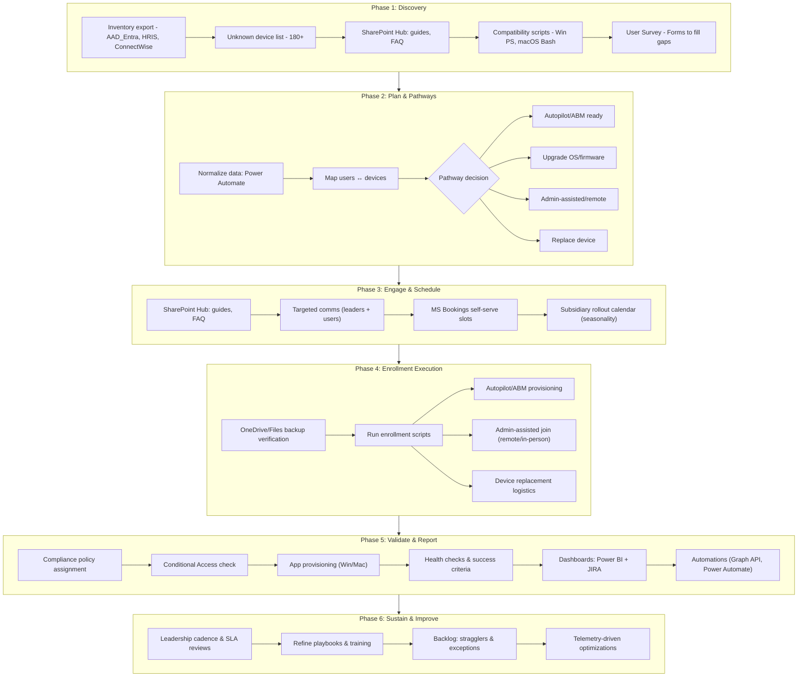

# Enterprise Intune Enrollment Project
A complete solution to migrate 180+ unmanaged devices (Windows &amp; macOS) into [Microsoft Intune](https://www.microsoft.com/en-us/security/business/microsoft-intune) using automation, compatibility checks, and leadership-focused communications.

## Problem
The client needed to migrate over 2,000 user devices across 11 subsidiaries into Microsoft Intune. While most were successfully onboarded, 180+ devices were unaccounted for and could not be enrolled remotely.

### Challenges
- A remote, non-technical user base, often unaware of IT compliance requirements.
- Manual enrollment processes that were error-prone, time-consuming, and inconsistent.
- Limited leadership buy-in across subsidiaries, slowing adoption.
- Seasonal workload variations that made timing and prioritization critical.

## Solution
To address these issues, a multi-pronged approach was designed:
1. Device Identification & Pathways
   - Developed scripts (Windows PowerShell + macOS Bash) to scan compatibility, OS version, and enrollment readiness.
   - Created clear enrollment pathways for each device type: upgrade, Autopilot, admin-assisted, or replacement.
2. User Engagement & Surveys
   - Deployed targeted surveys to collect device details from end users where technical data was missing.
   - Mapped survey responses against script results to close visibility gaps.
3. Communication & Scheduling
   - Built a SharePoint hub site as the central self-service portal with:
   - Enrollment guides
   - FAQ and troubleshooting
   - Integrated Microsoft Bookings so users could schedule IT enrollment sessions without back-and-forth emails.
   - Published a communications playbook for subsidiary leadership to drive awareness and accountability.
4. Reporting & Dashboards
   - Created Power BI and JIRA dashboards with real-time visibility into enrollment progress, broken down by subsidiary and device category.
   - Automated reporting flows using Power Automate + Microsoft Graph API, cutting manual tracking efforts.

## Results
- 180+ previously unknown devices identified and processed through structured pathways.
- 90% reduction in enrollment-related support tickets, freeing IT staff for higher-priority work.
- Cut rollout time by 3 months, thanks to automation and self-service.
- Leadership adoption improved significantly due to clear reporting and scheduled sessions, ensuring sustained compliance.200+ devices enrolled securely.
  
## Lessons Learned
- Leadership alignment was just as critical as technical execution.
- Mobile-first, simplified training content drove adoption in a younger, non-technical workforce.
- Embedding self-service tools (SharePoint, Bookings) reduced friction and scaled IT’s impacLeadership buy-in was just as critical as technical execution.
